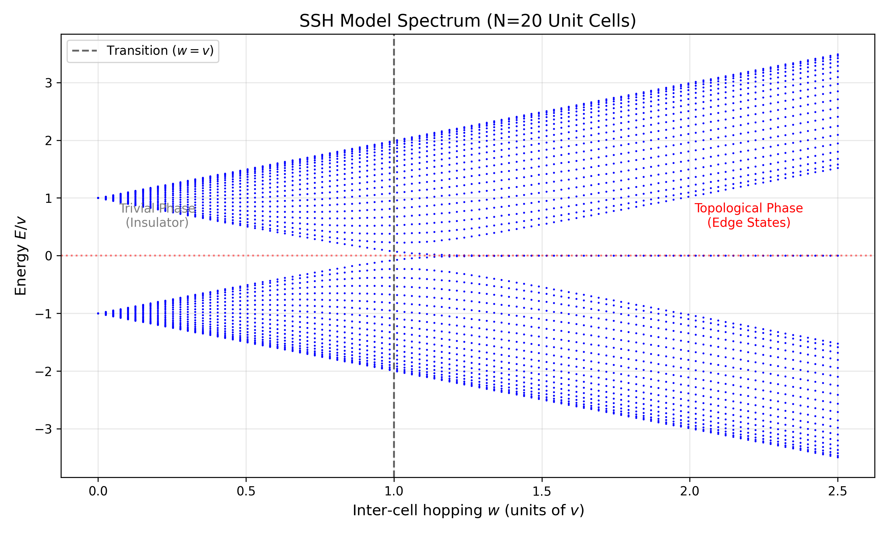

**Author:** Ayush Kumar

[](https://topological-quantum-simulation-bkws4kw33mrwn8jrcpm9r4.streamlit.app/)

**Affiliation:** IISER Bhopal / IIT Madras

### Overview
This project simulates the topological phase transition in a 1D dimerized lattice (SSH Model). The goal was to verify the **Bulk-Boundary Correspondence** numerically by observing the emergence of zero-energy edge states when the winding number is non-zero.

I wrote this Python script to diagonalize the tight-binding Hamiltonian and visualize the energy spectrum as a function of the hopping parameters.

### The Physics
The Hamiltonian for the chain is given by:

$$H = \sum_{n} (v |n,A\rangle\langle n,B| + w |n,B\rangle\langle n+1,A| + h.c.)$$

where:
- $v$: Intracell hopping amplitude.
- $w$: Intercell hopping amplitude.
- $h.c.$: Hermitian conjugate (adds the reverse hopping processes to ensure real energy).

**Phase Diagram:**
1. **Trivial Phase ($v > w$):** The bulk has an energy gap, and there are no states at $E=0$.
2. **Topological Phase ($w > v$):** The bulk gap remains open, but two degenerate states appear at exactly $E=0$. These are localized at the edges of the chain.

### Results
Running the simulation for $N=20$ unit cells yields the following spectrum:


*(Fig 1: As $w$ crosses $v$, the gap closes and reopens, leaving behind edge modes at zero energy.)*

### How to Run
Required libraries: `numpy`, `matplotlib`

```bash
python ssh_simulation.py
